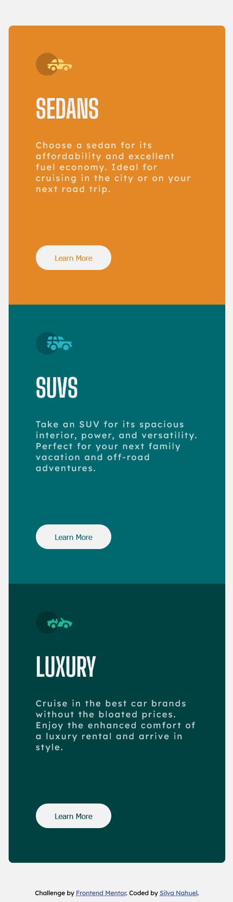

# Frontend Mentor - 3-column preview card component solution

This is a solution to the [3-column preview card component challenge on Frontend Mentor](https://www.frontendmentor.io/challenges/3column-preview-card-component-pH92eAR2-). Frontend Mentor challenges help you improve your coding skills by building realistic projects. 

## Table of contents

- [Overview](#overview)
  - [The challenge](#the-challenge)
  - [Screenshot](#screenshot)
  - [Links](#links)
- [My process](#my-process)
  - [Built with](#built-with)
  - [What I learned](#what-i-learned)
- [Author](#author)

**Note: Delete this note and update the table of contents based on what sections you keep.**

## Overview

### The challenge

Users should be able to:

- View the optimal layout depending on their device's screen size
- See hover states for interactive elements

### Screenshot




### Links

- Solution URL: [Solution](https://www.frontendmentor.io/solutions/3column-using-css-flexbox-6aAJdRbtqR)
- Live Site URL: [Github page](https://klonaush.github.io/3-column-preview-card-component/)

## My process

### Built with

- Semantic HTML5 markup
- CSS
- Flexbox

### What I learned

I didn't learn much, but it helped me to improve my knowledge in CSS and Flexbox.

```css
.container button {
    border: none;
    padding: 1em 2.5em;
    margin-bottom: 1em;
    border-radius: 2em;
    background-color: hsl(0, 0%, 95%);
}
```

## Author

- Frontend Mentor - [@klonaush](https://www.frontendmentor.io/profile/klonaush)
- Twitter - [@klonaush](https://www.twitter.com/klonaush)
